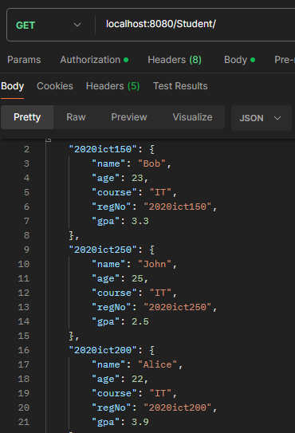
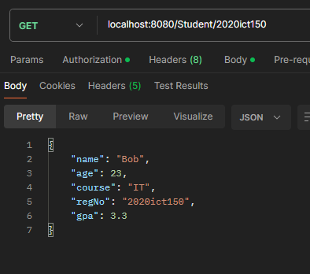
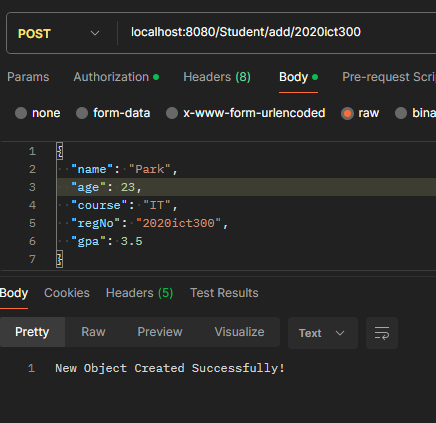
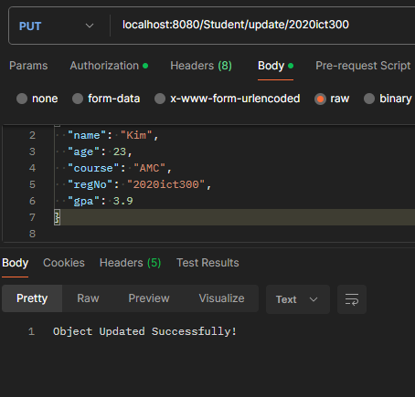
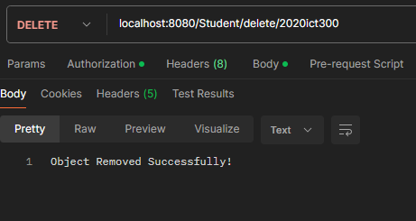
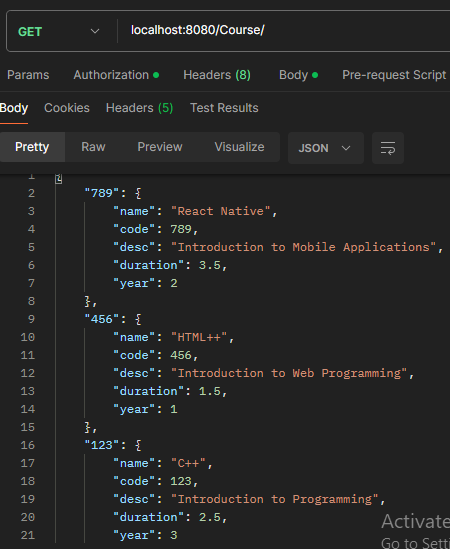
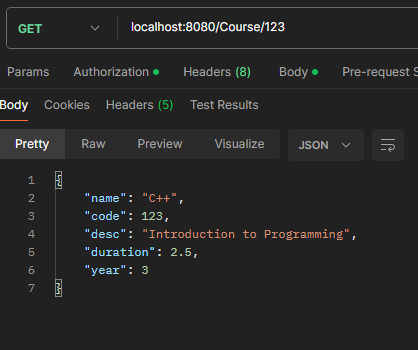
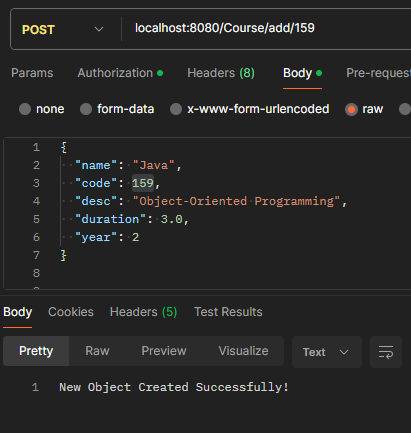
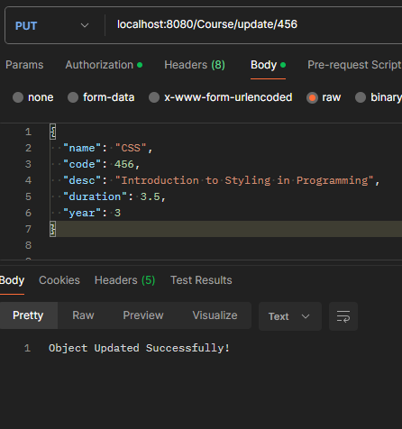
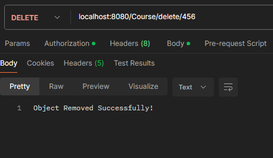

# IT3232 E-Commerce Practicals - Day 5 - 2025-04-08

## Project Overview

The project is organized into controllers and models:

### Controllers
- `ParentController.java`: A generic controller that provides CRUD operations for any entity
- `StudentWithParentController.java`: Controller for Student entities, extending ParentController
- `NewCourseController.java`: Controller for Course entities, extending ParentController

### Models
- `Student.java`: Model class for student information
- `Course.java`: Model class for course information

## API Endpoints

### Student API

#### Get All Students
```
GET /Student/
```
**Output:**

 

#### Get Student by Registration Number
```
GET /Student/{regNo}
```
**Output:**

 

#### Add New Student
```
POST /Student/add/{regNo}
```
Request Body:
```json
{
  "name": "Park",
  "age": 23,
  "course": "IT",
  "regNo": "2020ict300",
  "gpa": 3.5
}
```
**Output:**

 

#### Update Student
```
PUT /Student/update/{regNo}
```
Request Body:
```json
{
  "name": "Kim",
  "age": 23,
  "course": "AMC",
  "regNo": "2020ict300",
  "gpa": 3.9
}
```
**Output:**



#### Delete Student
```
DELETE /Student/delete/{regNo}
```
**Output:**



### Course API

#### Get All Courses
```
GET /Course/
```
**Output:**



#### Get Course by Code
```
GET /Course/{code}
```
**Output:**



#### Add New Course
```
POST /Course/add/{code}
```
Request Body:
```json
{
  "name": "Java",
  "code": 159,
  "desc": "Object-Oriented Programming",
  "duration": 3.0,
  "year": 2
}
```
**Output:**



#### Update Course
```
PUT /Course/update/{code}
```
Request Body:
```json
{
  "name": "CSS",
  "code": 456,
  "desc": "Introduction to Styling in Programming",
  "duration": 3.5,
  "year": 3
}
```
**Output:**



#### Delete Course
```
DELETE /Course/delete/{code}
```
**Output:**



## Initial Data

The application is preloaded with the following data:

### Students
- Bob (Reg. No: 2020ict150, GPA: 3.3)
- Alice (Reg. No: 2020ict200, GPA: 3.9)
- John (Reg. No: 2020ict250, GPA: 2.5)

### Courses
- C++ (Code: 123, Duration: 2.5 years, Year: 3)
- HTML++ (Code: 123, Duration: 1.5 years, Year: 1)
- React Native (Code: 123, Duration: 3.5 years, Year: 2)

## Technologies Used
- Spring Boot
- Java
- RESTful API
